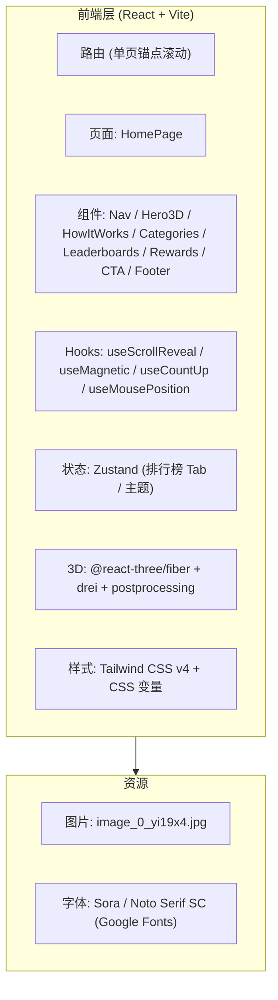

## 1. 架构设计



无后端，所有数据为前端 mock。

## 2. 技术选型

- **前端框架**：React 18 + TypeScript
- **构建工具**：Vite（通过 vite-init 模板 react-ts 创建）
- **样式**：Tailwind CSS v4（模板自带）+ CSS 变量（保留原设计令牌体系）
- **路由**：react-router-dom（仅首页，锚点滚动）
- **状态管理**：Zustand（排行榜 Tab 切换等轻量状态）
- **3D**：three + @react-three/fiber + @react-three/drei + @react-three/postprocessing
- **动画**：Framer Motion（滚动驱动、stagger、计数动画）+ CSS keyframes（轻量循环动效）
- **图标**：lucide-react
- **初始化工具**：vite-init（react-ts 模板）

## 3. 路由定义
| 路由 | 用途 |
|------|------|
| `/` | 首页（含所有区块，通过锚点滚动定位 #how-it-works / #categories / #leaderboards / #rewards / #join-cta） |

## 4. 目录结构
```
src/
├── components/
│   ├── layout/
│   │   ├── Navbar.tsx
│   │   └── Footer.tsx
│   ├── sections/
│   │   ├── Hero.tsx          # 含 3D 粒子场
│   │   ├── HowItWorks.tsx
│   │   ├── Categories.tsx
│   │   ├── Leaderboards.tsx
│   │   ├── Rewards.tsx
│   │   └── JoinCTA.tsx
│   └── three/
│       ├── ParticleField.tsx  # 流场粒子系统
│       └── PostFX.tsx         # Bloom + 色差后处理
├── hooks/
│   ├── useScrollReveal.ts
│   ├── useMagnetic.ts
│   ├── useCountUp.ts
│   └── useMousePosition.ts
├── pages/
│   └── HomePage.tsx
├── store/
│   └── useAppStore.ts
├── styles/
│   └── tokens.css            # 设计令牌（绿色品牌体系）
├── App.tsx
├── main.tsx
└── index.css
```

## 5. 关键实现策略

### 5.1 Hero 3D 粒子场
- 使用 `@react-three/fiber` 的 `<Canvas>` 作为 Hero 区背景（绝对定位、z-index 负值）
- `BufferGeometry` + `PointsMaterial` 渲染 2000 个粒子
- 在 `useFrame` 中按 Simplex 噪声驱动粒子位置，鼠标位置作为额外扰动力
- `@react-three/postprocessing` 的 `Bloom` + `ChromaticAberration` 增强发光与质感
- 移动端通过 `useMediaQuery` 检测后渲染降级版本（粒子数减半或直接卸载 Canvas）

### 5.2 滚动驱动动画
- Framer Motion 的 `useScroll` + `useTransform` 实现视差与 stagger
- `whileInView` 触发卡片上浮/缩放
- Hero 区主标题、副标题、按钮、数据使用 `motion.div` + `staggerChildren`

### 5.3 磁性按钮
- 自定义 `useMagnetic` hook：监听鼠标在按钮范围内的相对位置，通过 `motion.div` 的 `x/y` 平移实现磁性吸附
- 仅在桌面（hover 支持）启用

### 5.4 计数动画
- `useCountUp` hook：基于 `useInView` 触发，从 0 计数到目标值（12,860 / 6,420 / 8 等）

### 5.5 排行榜 Tab
- Zustand 存储当前选中分类
- 切换时通过 Framer Motion `AnimatePresence` 实现行 stagger 进入

### 5.6 响应式降级
- `useMediaQuery('(max-width: 768px)')` 控制 3D Canvas 是否挂载
- Tailwind 断点：`sm: 640px`、`md: 768px`、`lg: 1024px`、`xl: 1280px`

## 6. 性能与可访问性
- `prefers-reduced-motion` 检测后关闭所有非必要动画
- 3D Canvas 使用 `dpr={[1, 2]}` 限制像素比
- 粒子数根据视口动态调整
- 所有交互元素具备 `:focus-visible` 样式
- 图片使用 `loading="lazy"`
